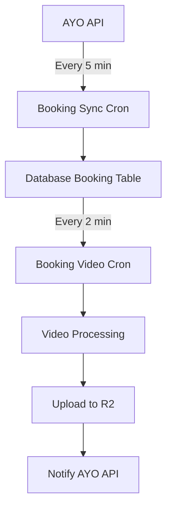

# 📅 Sistem Manajemen Booking

Sistem ini menyimpan dan mengelola data booking dari AYO API ke dalam database lokal, dengan kemampuan monitoring dan sinkronisasi status.

## 🏗️ **Database Schema**

### Tabel `bookings`
```sql
CREATE TABLE bookings (
    id INTEGER PRIMARY KEY AUTOINCREMENT,
    booking_id TEXT NOT NULL UNIQUE,
    order_detail_id INTEGER,
    field_id INTEGER,
    date TEXT,
    start_time TEXT,
    end_time TEXT,
    status TEXT,
    field_name TEXT,
    user_name TEXT,
    user_phone TEXT,
    created_at DATETIME DEFAULT CURRENT_TIMESTAMP,
    updated_at DATETIME DEFAULT CURRENT_TIMESTAMP,
    raw_json TEXT,
    last_sync_at DATETIME DEFAULT CURRENT_TIMESTAMP
);
```

### Indexes untuk Performance
```sql
CREATE INDEX idx_bookings_booking_id ON bookings (booking_id);
CREATE INDEX idx_bookings_date ON bookings (date);
CREATE INDEX idx_bookings_status ON bookings (status);
CREATE INDEX idx_bookings_field_id ON bookings (field_id);
```

## 🔄 **Proses Sinkronisasi**

### 1. **Penyimpanan Data Booking**
- Setiap 2 menit, sistem mengambil data booking dari AYO API
- Data booking disimpan/diupdate ke tabel `bookings`
- Format data JSON lengkap disimpan di kolom `raw_json`
- Waktu sinkronisasi terakhir dicatat di `last_sync_at`

### 2. **Penanganan Status Cancelled**
```go
// Handle cancelled bookings - update video status if exists
if status == "cancelled" {
    existingVideos, err := db.GetVideosByBookingID(bookingID)
    if err == nil && len(existingVideos) > 0 {
        // Update all videos for this booking to cancelled status
        for _, video := range existingVideos {
            if video.Status != database.StatusCancelled {
                err := db.UpdateVideoStatus(video.ID, database.StatusCancelled, "Booking cancelled via API")
                log.Printf("📅 BOOKING: Updated video %s to cancelled status for booking %s", video.ID, bookingID)
            }
        }
    }
    log.Printf("processBookings : Booking %s is cancelled, skipping video processing", bookingID)
    continue
}
```

## 🌐 **API Endpoints**

### 1. **GET /api/bookings**
Mengambil daftar booking dengan filter opsional
```bash
# Semua booking (limit 100)
curl http://localhost:8080/api/bookings

# Filter berdasarkan status
curl http://localhost:8080/api/bookings?status=success

# Filter berdasarkan tanggal
curl http://localhost:8080/api/bookings?date=2025-01-23

# Dengan limit
curl http://localhost:8080/api/bookings?limit=50
```

**Response:**
```json
{
    "status": "success",
    "count": 10,
    "data": [
        {
            "id": 1,
            "bookingId": "BK-123456",
            "orderDetailId": 789,
            "fieldId": 1,
            "date": "2025-01-23",
            "startTime": "10:00:00",
            "endTime": "12:00:00",
            "status": "success",
            "fieldName": "Lapangan A",
            "userName": "John Doe",
            "userPhone": "081234567890",
            "createdAt": "2025-01-23T08:00:00Z",
            "updatedAt": "2025-01-23T08:00:00Z",
            "rawJson": "{...}",
            "lastSyncAt": "2025-01-23T08:00:00Z"
        }
    ]
}
```

### 2. **GET /api/bookings/:booking_id**
Mengambil booking berdasarkan ID
```bash
curl http://localhost:8080/api/bookings/BK-123456
```

### 3. **GET /api/bookings/status/:status**
Mengambil booking berdasarkan status
```bash
# Booking yang sukses
curl http://localhost:8080/api/bookings/status/success

# Booking yang dibatalkan
curl http://localhost:8080/api/bookings/status/cancelled
```

### 4. **GET /api/bookings/date/:date**
Mengambil booking berdasarkan tanggal (format: YYYY-MM-DD)
```bash
curl http://localhost:8080/api/bookings/date/2025-01-23
```

## 🎯 **Status Booking**

| Status | Keterangan |
|--------|------------|
| `success` | Booking berhasil dan siap diproses |
| `cancelled` | Booking dibatalkan |
| `pending` | Booking menunggu konfirmasi |
| `expired` | Booking kedaluwarsa |

## 🔄 **Workflow Status Update**

1. **Booking Baru**: Status `success` → Video diproses
2. **Booking Dibatalkan**: Status `cancelled` → Video yang sudah ada diupdate ke status `cancelled`
3. **Sinkronisasi**: Setiap kali ada perubahan status dari API, data lokal akan diupdate

## 📊 **Monitoring & Logging**

### Log Format
```bash
📅 BOOKING: Created new booking BK-123456 (status: success)
📅 BOOKING: Updated booking BK-123456 (status: cancelled)
📅 BOOKING: Updated video VIDEO-ID to cancelled status for booking BK-123456
```

### Database Operations
- **CREATE**: Booking baru dari API
- **UPDATE**: Perubahan status atau data booking
- **SYNC**: Sinkronisasi dengan timestamp terakhir

## 🛠️ **Database Methods**

```go
// Database interface methods untuk booking
CreateOrUpdateBooking(booking BookingData) error
GetBookingByID(bookingID string) (*BookingData, error)
GetBookingsByDate(date string) ([]BookingData, error)
GetBookingsByStatus(status string) ([]BookingData, error)
UpdateBookingStatus(bookingID string, status string) error
DeleteOldBookings(olderThan time.Time) error
```

## 🧹 **Maintenance**

### Cleanup Old Bookings
Sistem menyediakan method untuk menghapus booking lama:
```go
// Hapus booking lebih dari 90 hari
olderThan := time.Now().AddDate(0, 0, -90)
err := db.DeleteOldBookings(olderThan)
```

### Backup Raw JSON
Data JSON lengkap dari API disimpan di kolom `raw_json` untuk:
- Audit trail
- Recovery data
- Debug purposes
- Migration ke format baru

## 🔧 **Konfigurasi & Arsitektur**

Sistem booking terdiri dari **2 cron job terpisah** untuk better separation of concerns:

### 1. **Booking Sync Cron** (`booking_sync_cron.go`)
- **Interval**: Setiap 5 menit
- **Fungsi**: Sinkronisasi data booking dari AYO API ke database
- **Process**: 
  - Ambil data dari API → Parse → Simpan/Update database
  - Handle status changes (SUCCESS, CANCELLED, etc.)

### 2. **Booking Video Cron** (`booking_video_cron.go`)  
- **Interval**: Setiap 2 menit
- **Fungsi**: Proses video berdasarkan data booking dari database
- **Process**:
  - Ambil booking dari database → Filter → Proses video → Upload → Notify API
- **Retry Logic**: ✅ Video Processing (3x), File Upload (5x), API Notification (3x)
- **Offline Mode**: ✅ Queue Manager, Connectivity Check, Automatic Fallback

### 3. **Booking Video Request Handler** (`booking_video_request_handler.go`)
- **Endpoint**: `POST /api/request-booking-video`
- **Fungsi**: Manual request video clip untuk field_id tertentu
- **Process**:
  - Ambil booking dari database → Match dengan current time → Proses video → Upload → Notify API
- **Updated**: Sekarang menggunakan database instead of API call

## 🔄 **Flow Sistem Baru**



## 📊 **Keuntungan Arsitektur Baru**

1. **🔄 Separation of Concerns**: Data sync dan video processing terpisah
2. **⚡ Performance**: Video processing tidak terganggu jika API lambat
3. **🛡️ Reliability**: Data booking sudah tersimpan meskipun video processing gagal
4. **📊 Monitoring**: Bisa monitor sync dan processing secara terpisah
5. **📈 Scalability**: Bisa adjust interval masing-masing sesuai kebutuhan
6. **🗂️ Consistency**: Manual request dan scheduled processing menggunakan data source yang sama
7. **💾 Cache**: Data booking di-cache di database untuk performance
8. **🔄 Single Loop**: Eliminasi double looping untuk efisiensi
9. **🔄 Robust Retry Logic**: Automatic retry dengan exponential backoff untuk semua operations
10. **📶 Offline Queue**: Automatic queue management untuk network outages
11. **🌐 Connectivity Aware**: Smart detection online/offline status

## 🚀 **Perubahan dari API ke Database**

### **Sebelum:**
```go
// Get bookings from AYO API
response, err := ayoClient.GetBookings(today)
data, ok := response["data"].([]interface{})

// Parse map[string]interface{}
for _, item := range data {
    booking, ok := item.(map[string]interface{})
    bookingID, _ := booking["booking_id"].(string)
    // ... complex parsing
}
```

### **Sesudah:**
```go
// Get bookings from database
bookingsData, err := h.db.GetBookingsByDate(today)

// Direct struct access
for _, booking := range bookingsData {
    bookingID := booking.BookingID
    status := booking.Status
    // ... direct field access
}
```

## 🔄 **Retry Logic Implementation**

Kedua cron job (`booking_video_cron.go` dan `booking_video_request_handler.go`) sekarang menggunakan **retry logic yang sama** untuk meningkatkan reliability:

### **Retry Policy:**
- **🎬 Video Processing**: 3x retry dengan delay 3s, 6s, 12s
- **📤 File Upload**: 5x retry dengan delay 3s, 6s, 9s, 12s, 15s  
- **🔔 API Notification**: 3x retry dengan delay 3s, 6s, 12s

### **Error Handling:**
```go
// RETRY ALL ERRORS - semua error bisa temporary
func isRetryableError(err error) bool {
    if err == nil {
        return false
    }
    log.Printf("🔄 RETRY: Will retry error: %v", err)
    return true
}
```

### **Logging Format:**
```bash
🔄 RETRY: Will retry error: connection timeout
🔄 RETRY: File Upload for BK-123-CAMERA_A ✅ Berhasil setelah 2 kali retry
🔄 RETRY: API Notification for BK-123-CAMERA_A ❌ Gagal setelah 3 percobaan
```

### **Implementation Example:**
```go
// Video Processing dengan retry
var uniqueID string
err = cleanRetryWithBackoff(func() error {
    var err error
    uniqueID, err = bookingService.ProcessVideoSegments(
        camera, bookingID, orderDetailIDStr, segments,
        startTime, endTime, bookingData.RawJSON, videoType,
    )
    return err
}, 3, fmt.Sprintf("Video Processing for %s-%s", bookingID, camera.Name))

if err != nil {
    log.Printf("❌ ERROR: Video processing failed after retries: %v", err)
    db.UpdateVideoStatus(uniqueID, database.StatusFailed, 
        fmt.Sprintf("Video processing failed: %v", err))
    return
}
```

## 📶 **Offline Mode & Queue Management**

Kedua sistem (`booking_video_cron.go` dan `booking_video_request_handler.go`) sekarang memiliki **offline queue management** yang lengkap:

### **Connectivity Detection:**
```go
connectivityChecker := offline.NewConnectivityChecker()

if connectivityChecker.IsOnline() {
    log.Printf("🌐 CONNECTIVITY: Online - mencoba upload langsung...")
    // Try direct upload with retry
} else {
    log.Printf("🌐 CONNECTIVITY: Offline - menambahkan ke queue...")
    // Add to offline queue
}
```

### **Queue Operations:**
- **📤 R2 Upload Queue**: File upload tasks (MP4, preview, thumbnail)
- **🔔 API Notification Queue**: AYO API notification tasks
- **⚡ Auto Processing**: Background processing saat online
- **🔄 Dependency Management**: API notification waits for upload completion

### **Workflow Scenarios:**

#### **🌐 Online Mode:**
1. Video Processing → ✅ Direct Upload → ✅ Direct API Notification
2. Video Processing → ❌ Upload Failed → 📦 Queue Upload → 📦 Queue Notification
3. Video Processing → ✅ Upload Success → ❌ API Failed → 📦 Queue Notification

#### **📴 Offline Mode:**
1. Video Processing → 📦 Queue Upload → 📦 Queue Notification → ⏳ Wait for connectivity

#### **🔄 Recovery Mode:**
1. Connectivity restored → 🚀 Process queued uploads → 🚀 Process queued notifications

### **Queue Manager Features:**
```go
// Initialize queue manager with full capabilities
queueManager := offline.NewQueueManager(db, uploadService, r2Client, ayoClient, cfg)
queueManager.Start()

// Enqueue R2 upload task
queueManager.EnqueueR2Upload(uniqueID, mp4Path, previewPath, thumbnailPath, ...)

// Enqueue API notification task  
queueManager.EnqueueAyoAPINotify(uniqueID, videoID, mp4URL, previewURL, thumbnailURL, duration)
```

### **Monitoring & Logging:**
```bash
🌐 CONNECTIVITY: Online - mencoba upload langsung untuk BK-123-CAMERA_A...
📤 SUCCESS: Direct upload completed for BK-123-CAMERA_A
🔔 SUCCESS: Direct API notification sent for BK-123-CAMERA_A

🌐 CONNECTIVITY: Offline - menambahkan upload task ke queue untuk BK-456-CAMERA_B...
📦 QUEUE: Upload task queued untuk video VIDEO-456 - akan diproses saat online
📦 QUEUE: API notification task queued untuk video VIDEO-456
```

### **Reliability Benefits:**
1. **🛡️ Zero Data Loss**: Semua tasks di-queue jika tidak bisa diproses langsung
2. **⚡ Automatic Recovery**: Auto-process saat connectivity restored
3. **📊 Dependency Aware**: API notification waits for upload completion
4. **🔄 Retry Integration**: Queue combined dengan retry mechanism
5. **📈 Scalability**: Background processing tidak block main operations

## 🎮 **Testing**

```bash
# Build aplikasi
go build -o ayo-mwr .

# Jalankan aplikasi
./ayo-mwr

# Test API endpoint
curl http://localhost:8080/api/bookings
``` 